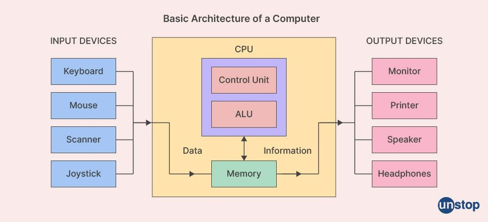
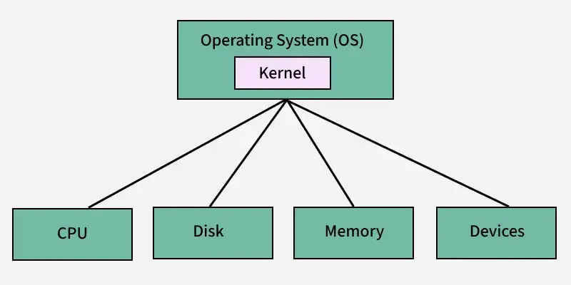

# The Why? of containers

## Introduction 
Development and deployment of software has been an influential part of the tech boom and while it is important to know how to build goood software, it is even more important to make sure it is avaialble to your users.  

It is fairly straightforward to ` npm run dev ` a web application locally, and expose your ports to the local network so that your friends
can view and use your application, you have done this for your WEB101 and WEB102 classes, but what if :
1. You have 1000 people using your application at the same time.
2. Many users are not connected to the same local network.  

In the past you have used web applications like Netlify and Render to address these issues, throughout the course of this module we will try to understand how these applications achieve seamless integration and deployment flow of our applications while also learning how to re-create these flows on bare metal servers.  

## Understanding the Computer Architecture

A computer is made out of physical parts such as the Central Processing Unit (CPU), Random Access Memory (RAM), Solid State Drives (SSD), Graphical Processing Unit (GPUs), and much more. These tangible physical components are known as the **physical resources** of a computer.

Their functons include:
1. CPU (Central Processing Unit): The brain of the computer which executes all instructions. 
2. RAM (Random Access Memory): Temporary storage for running programs.
3. Storage (HDD/SSD): Permanent storage for data and programs.
4. Motherboard: The backbone connecting all components.
5. I/O Devices: Input/output devices like keyboards, monitors, and network cards.

Apart from these hardware resources, there are softwares running on your computer such as:
1. Operating Systems (OS): An application that manages hardware and software resources on your computer.
    - Its core functionality includes process management, memory management and device management.
2. Kernel: A core part of OS that helps communication between the software and underlying hardware in a computer. 
    - Its core functionality includes managing processes and threads and handling system calls, most importantly memory allocation and memory space protection. 

You can learn more about kernels [here](https://www.youtube.com/watch?v=IvGdY6luTtU). 

## Processes and threads

A process is running instance of a computer program, it is an active entity that includes the program instructions that is being executed, data that is being manipulated in the execution, and state of the process itself. You will learn more about this in your OS class. However, you may refer to the following [video](https://www.youtube.com/watch?v=9GDX-IyZ_C8) explaining the concept of processes, threads, and how a CPU executes a program. 

## Why containers?

A modern day application comes with many moving parts, with applications that may require seperate code bases for front-end, back-end and databases. Each application further comes with its own set of dependencies and libraries that it requires to function as intended. 

A problem programmers often faced is that an application would function as intended in one machine, would not behave the same when it is run in a different machine. This could be due to different machine specifications (hardware), or different packages and libraries installed (software). Either way, in a production environment, it is important for applications to function as intended across multiple machines used by potentially millions of users.  

There are two primary ways to solve this problem, ***Virtual Machines (VMs)*** which was the old way of virtualizing operating systems and the modern adaptation called ***containers***. 

The primary goal of a container is to create a *consistent*, *isolated* and *portable* environment for ***developing***, ***deploying*** and ***running*** applications. A container achieves this by running an instance of an application as an isolated process which is managed by a container engine, which then shares the underlying resources via the host operating system. 

