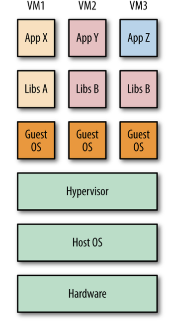
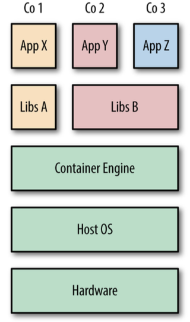

# Docker containers V/s VMs

While at a glance, a VM and a Docker Container may seem similar as they achieve the same outcome, isolation of an instance of application, they do so differently whereby:
- ***VMs:*** In the image below showing a a standard VM architecture ,the hypervisor is required to create and run VMs, controlling access to the underlying OS and hardware as well as interpreting system calls when necessary. Each VM requires a full copy of the OS, the application being run, and any supporting libraries.  

  

- ***Containers:*** unlike VMs, the host’s kernel is shared with the running containers. This means that containers are always constrained to running the same kernel as the host. Applications Y and Z use the same libraries and can share this data rather than having redundant copies. The container engine is responsible for starting and stopping containers in a similar way to the hypervisor on a VM. However, processes running inside containers are equivalent to native processes on the host and do not incur the overheads associated with hypervisor execution.

 

## Hybrid systems 
Both VMs and containers can be used to isolate applications from other applications running on the same host. VMs have an added degree of isolation from the hypervisor and are a trusted and battle-hardened technology. Containers are comparatively new, and many organizations are hesitant to completely trust the isolation features of containers before they have a proven track record. For this reason, it is common to find hybrid systems with containers running inside VMs in order to take advantage of both technologies.
