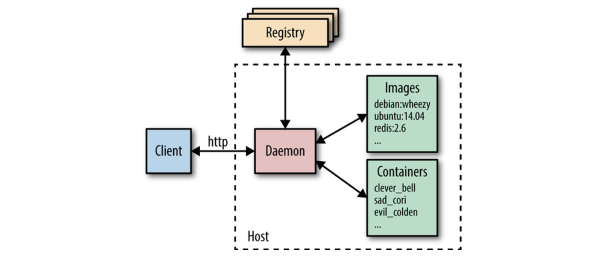

#  Why docker?
Containerisation and isolation of file systems is an old concept. OpenVZ was an open source implmenetation of containers for linux systems which was made avaialable to public in 2005. However the modern day implementation of docker containers came into picture in 2013.

What did docker do differently from existing containerization tech?
- Portable images: Docker introduced the concept of portable container images. These images are self-contained units that include the application and all its dependencies, making them easy to share and run anywhere Docker is installed.
- Cross platform support across different operating systems
- A rich ecosystem of tools and services such as the Docker Hub, Dokcer compose etc. 

## The docker architecture.

The docker daemon is responsible for running, creating and monitoring the docker container. The docker daemon is handled by the host OS. The docker client (CLI tool), is used to communicate with the docker daemon via HTTP. This makes it possible and easy to remotely configure a container.  

The docker registry is a remote source of images which often contains all versions of packages, programmes and other important files that you may need to standardize for a container. Big companies host their own registries, however the docker hub is the default docker registry from which a user may `pull` necesarry images.

A docker file contains instructions that builds a docker image. A docker image is a snap-shot of your application along with all its dependencies (from specific packages to OS). Note that a docker image is immutable and can be run anywhere on any environment as long as you can install docker on it. You can refer to this resource to understand [more](https://www.youtube.com/watch?v=Ud7Npgi6x8E).

